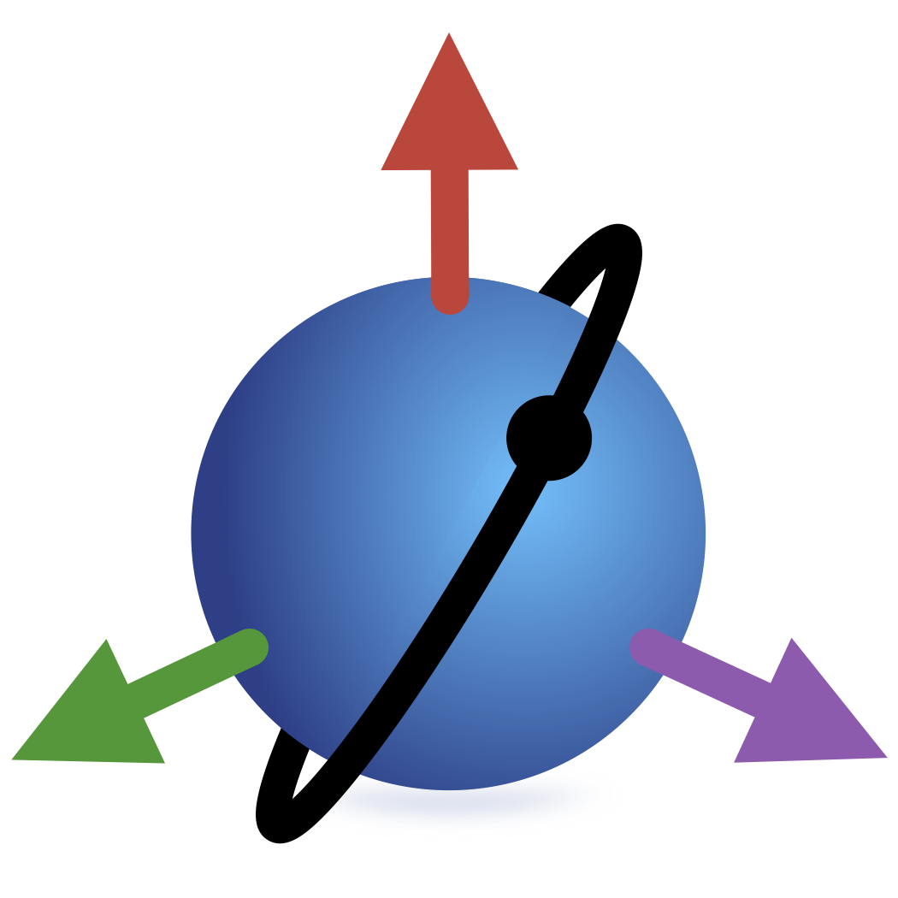

<p align="center">
  <br>
  <small><i>This package is part of the <a href="https://github.com/JuliaSpace/SatelliteToolbox.jl">SatelliteToolbox.jl</a> ecosystem.</i></small>
</p>

# SatelliteToolboxTle.jl

[](https://github.com/JuliaSpace/SatelliteToolboxTle.jl/actions/workflows/ci.yml)
[](https://codecov.io/gh/JuliaSpace/SatelliteToolboxTle.jl)
[][docs-stable-url]
[][docs-dev-url]
[](https://github.com/invenia/BlueStyle)
[](https://github.com/JuliaSpace/SatelliteToolboxTle.jl/blob/main/LICENSE)
[](https://zenodo.org/doi/10.5281/zenodo.11245282)

This package allows creating, fetching, and parsing TLEs (two-line elements).

## Two-line elements

The TLE, or two-line elements, is a fixed-width format that express the mean
elements of a object en Earth's orbit. They are used as input for the Simplified
General Perturbation Model 4 (SGP4 / SDP4) to propagate satellite orbits.

For more information about the TLE, see
[Two-line element set](https://en.wikipedia.org/wiki/Two-line_element_set).

## Installation

This package can be installed using:

``` julia
julia> using Pkg
julia> Pkg.add("SatelliteToolboxTle")
```

## Documentation

For more information, see the [documentation][docs-stable-url].

[docs-dev-url]: https://juliaspace.github.io/SatelliteToolboxTle.jl/dev
[docs-stable-url]: https://juliaspace.github.io/SatelliteToolboxTle.jl/stable
